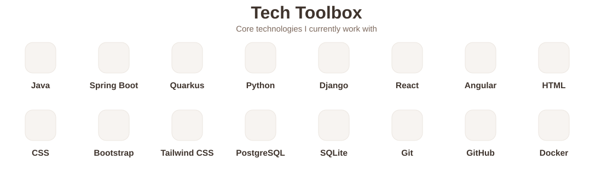

<!-- GitHub profile README for github.com/heyitsmanal -->

<picture>
  <source media="(prefers-color-scheme: dark)" srcset="./assets/wave-dark.svg" />
  <source media="(prefers-color-scheme: light)" srcset="./assets/wave-light.svg" />
  
</picture>

  <strong>Manal</strong> 
  <strong>Full-Stack Developer</strong>

 

  
  &nbsp;&nbsp;&nbsp;&nbsp;&nbsp;&nbsp;&nbsp;&nbsp;&nbsp;&nbsp;
  
  &nbsp;&nbsp;&nbsp;&nbsp;&nbsp;&nbsp;&nbsp;&nbsp;&nbsp;&nbsp;
  

<picture>
  <source media="(prefers-color-scheme: dark)" srcset="./assets/about-focus-dark.svg" />
  <source media="(prefers-color-scheme: light)" srcset="./assets/about-focus-light.svg" />
  
</picture>

<picture>
  <source media="(prefers-color-scheme: dark)" srcset="./assets/toolbox-dark.svg" />
  <source media="(prefers-color-scheme: light)" srcset="./assets/toolbox-light.svg" />
  
</picture>

  <picture>
    <source media="(prefers-color-scheme: dark)" srcset="https://raw.githubusercontent.com/heyitsmanal/heyitsmanal/output/github-contribution-grid-snake-beige-dark.svg" />
    <source media="(prefers-color-scheme: light)" srcset="https://raw.githubusercontent.com/heyitsmanal/heyitsmanal/output/github-contribution-grid-snake-beige.svg" />
    
  </picture>

