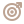

<!--
  GitHub profile README for github.com/heyitsmanal
  GitHub-native implementation: no JavaScript, no custom CSS, no fake statistics.
  TODO: replace the Website href="#" below with the real portfolio URL when it is ready.
-->

<table width="100%">
<tr>
<td width="52%" valign="middle">

# Manal

## Full-Stack Developer

</td>
<td width="48%" valign="middle" align="right">

<picture>
  <source media="(prefers-color-scheme: dark)" srcset="./assets/wave-dark.svg" />
  <source media="(prefers-color-scheme: light)" srcset="./assets/wave-light.svg" />
  
</picture>

</td>
</tr>
</table>

  
  &nbsp;&nbsp;&nbsp;&nbsp;&nbsp;&nbsp;
  
  &nbsp;&nbsp;&nbsp;&nbsp;&nbsp;&nbsp;
  

<table border="0" cellspacing="0" cellpadding="0">
<tr>
<td width="65%" valign="top">

###  Who I Am

I'm Manal, a Full-Stack Developer focused on building reliable web applications from back end to front end.

I enjoy strengthening my back-end skills while also paying attention to UI/UX, testing, and deployment.

</td>
<td width="35%" valign="top">

###  Current Focus

&nbsp; Solidifying back-end craftsmanship with Java, Spring Boot, and Django  
&nbsp; Shipping polished UI/UX and deployable demos  
&nbsp; Writing tests and CI workflows to improve quality

</td>
</tr>
</table>

<h2 align="center">Tech Toolbox</h2>

  <picture>
    <source media="(prefers-color-scheme: dark)" srcset="./assets/toolbox-accent-dark.svg" />
    <source media="(prefers-color-scheme: light)" srcset="./assets/toolbox-accent-light.svg" />
    
  </picture>

  &nbsp;&nbsp;&nbsp;
  &nbsp;&nbsp;&nbsp;
  &nbsp;&nbsp;&nbsp;
  &nbsp;&nbsp;&nbsp;
  &nbsp;&nbsp;&nbsp;
  &nbsp;&nbsp;&nbsp;
  &nbsp;&nbsp;&nbsp;
  
    
  &nbsp;&nbsp;&nbsp;
  &nbsp;&nbsp;&nbsp;
  &nbsp;&nbsp;&nbsp;
  &nbsp;&nbsp;&nbsp;
  &nbsp;&nbsp;&nbsp;
  &nbsp;&nbsp;&nbsp;
  &nbsp;&nbsp;&nbsp;
  

 

  <picture>
    <source media="(prefers-color-scheme: dark)" srcset="https://raw.githubusercontent.com/heyitsmanal/heyitsmanal/output/github-contribution-grid-snake-dark.svg" />
    <source media="(prefers-color-scheme: light)" srcset="https://raw.githubusercontent.com/heyitsmanal/heyitsmanal/output/github-contribution-grid-snake.svg" />
    
  </picture>

build → learn → improve → repeat

