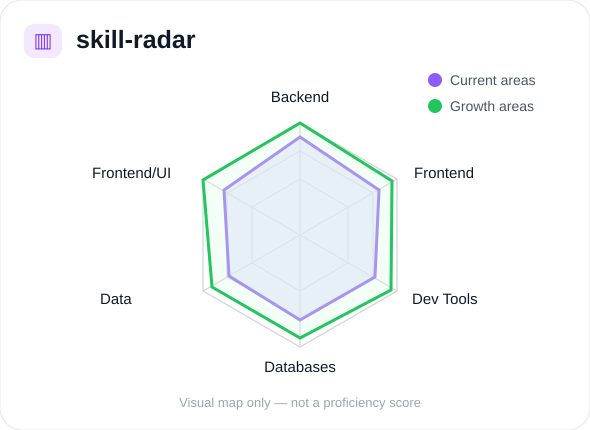
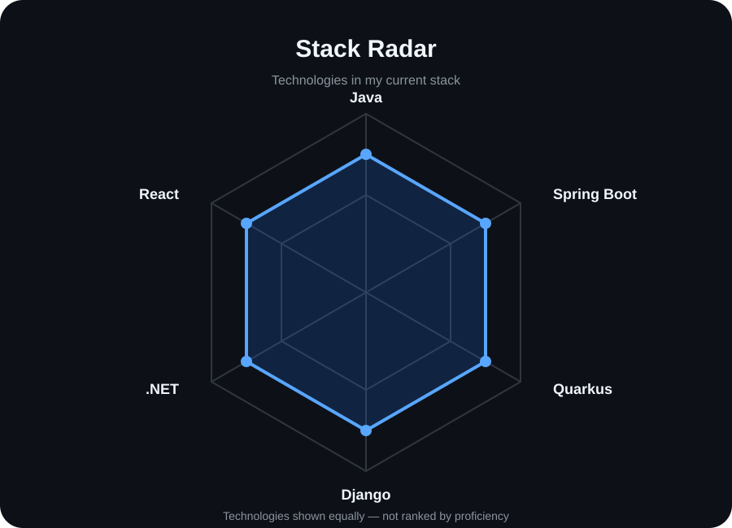

# manal@github:~$

<p align="center">
  <strong>Full-Stack Developer</strong><br>
  Java · Spring Boot · Quarkus · Django · React · React
</p>

<p align="center">
  Building reliable web apps end-to-end · Curious about data apps & product UX
</p>

---

## `~/` whoami

I'm **Manal**, a Full-Stack Developer focused on building reliable web applications from back end to front end.

I enjoy strengthening my back-end skills while also paying attention to UI/UX, testing, and deployment.

---

## `~/` current-focus

```text
→ Solidifying back-end craftsmanship with Java, Spring Boot, and Django
→ Shipping polished UI/UX and deployable demos
→ Writing tests and CI workflows to improve quality
---

## `~/` current-focus

```text
→ Solidifying back-end craftsmanship with Java, Spring Boot, and Django
→ Shipping polished UI/UX and deployable demos
→ Writing tests and CI workflows to improve quality
```

---

## `~/` toolbox

### Backend

`Java` · `Spring Boot` · `Quarkus` · `Python` · `Django` · `Django REST Framework` · `ASP.NET Core` · `Entity Framework`

### Frontend

`React` · `HTML` · `CSS` · `Bootstrap` · `Tailwind CSS`

### Data

`Pandas`

### Databases

`SQLite` · `PostgreSQL`

### Tools

`Git` · `GitHub` · `GitHub Actions` · `Docker`

---

## `~/` skill-radar

<p align="center">
  
  
</p>

---

## `~/` contribution-calendar

<p align="center">
  
</p>

---

## `~/` github-stats

<p align="center">
  

  
</p>

---

## `~/` selected-work

```json
{
```

### Traineeship Management

**Stack:** Django

Web application for traineeship management.

[View repository](https://github.com/heyitsmanal/django_traineeship_management)

---

### Sentiment Analysis Dashboard

**Stack:** Streamlit

Dashboard for sentiment-analysis work.

[View repository](https://github.com/heyitsmanal/sentiment-analys-dashboard)

---

### Cabinet Medical

**Stack:** .NET

Medical cabinet management application.

[View repository](https://github.com/heyitsmanal/dotnet-cabinetmedical)

```json
}
```

---

## `~/` status

```bash
$ echo $OPEN_TO
```

```text
Internships
Junior software engineering roles
Backend-leaning full-stack work
Code reviews
```

---

## `~/` notes

```text
See each repository README for architecture,
setup instructions, tests, and screenshots.
```

---

<p align="center">
  <code>build → learn → improve → repeat</code>
</p>
```

For the full effect, I would also create this structure:

```text
heyitsmanal/
│
├── README.md
│
├── assets/
│   ├── skill-radar.svg
│   └── stack-radar.svg
│
└── .github/
    └── workflows/
        └── snake.yml
```

I’d make the two radar charts visually similar to hers, but based only on your confirmed stack. For example, one chart could be **Backend / Frontend / Data / Databases / Dev Tools**, while the second could show **Java / Python / C# / JavaScript / SQL**.

The next useful step is for me to generate the actual `skill-radar.svg`, `stack-radar.svg`, and `snake.yml` files so you can drop them directly into your profile repo.
