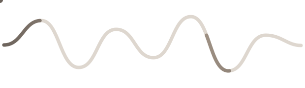
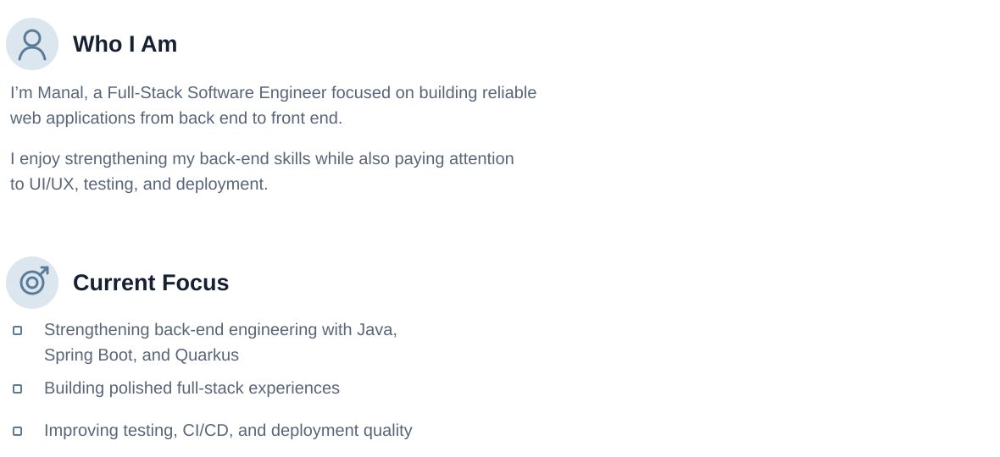

<!--
  GitHub profile README for github.com/heyitsmanal
  GitHub-native implementation: no JavaScript, no custom CSS, no fake statistics.
  TODO: replace the Website href="#" below with the real portfolio URL when it is ready.
-->

<picture>
  <source media="(prefers-color-scheme: dark)" srcset="./assets/wave-dark.svg" />
  <source media="(prefers-color-scheme: light)" srcset="./assets/wave-light.svg" />
  
</picture>

<strong>Manal</strong> 
<strong>Full-Stack Developer</strong>

 

  
  &nbsp;&nbsp;&nbsp;&nbsp;&nbsp;&nbsp;&nbsp;&nbsp;
  
  &nbsp;&nbsp;&nbsp;&nbsp;&nbsp;&nbsp;&nbsp;&nbsp;
  

<picture>
  <source media="(prefers-color-scheme: dark)" srcset="./assets/about-focus-dark.svg" />
  <source media="(prefers-color-scheme: light)" srcset="./assets/about-focus-light.svg" />
  
</picture>

<h2 align="center">Tech Toolbox</h2>

   Java&nbsp;&nbsp;&nbsp;&nbsp;&nbsp;
   Spring Boot&nbsp;&nbsp;&nbsp;&nbsp;&nbsp;
   Quarkus&nbsp;&nbsp;&nbsp;&nbsp;&nbsp;
   Python&nbsp;&nbsp;&nbsp;&nbsp;&nbsp;
   Django&nbsp;&nbsp;&nbsp;&nbsp;&nbsp;
   React&nbsp;&nbsp;&nbsp;&nbsp;&nbsp;
   Angular
     
   HTML&nbsp;&nbsp;&nbsp;&nbsp;&nbsp;
   CSS&nbsp;&nbsp;&nbsp;&nbsp;&nbsp;
   Bootstrap&nbsp;&nbsp;&nbsp;&nbsp;&nbsp;
   Tailwind CSS&nbsp;&nbsp;&nbsp;&nbsp;&nbsp;
   PostgreSQL&nbsp;&nbsp;&nbsp;&nbsp;&nbsp;
   SQLite&nbsp;&nbsp;&nbsp;&nbsp;&nbsp;
   Git&nbsp;&nbsp;&nbsp;&nbsp;&nbsp;
   GitHub&nbsp;&nbsp;&nbsp;&nbsp;&nbsp;
   Docker

  <picture>
    <source media="(prefers-color-scheme: dark)" srcset="https://raw.githubusercontent.com/heyitsmanal/heyitsmanal/output/github-contribution-grid-snake-beige-dark.svg" />
    <source media="(prefers-color-scheme: light)" srcset="https://raw.githubusercontent.com/heyitsmanal/heyitsmanal/output/github-contribution-grid-snake-beige.svg" />
    
  </picture>

