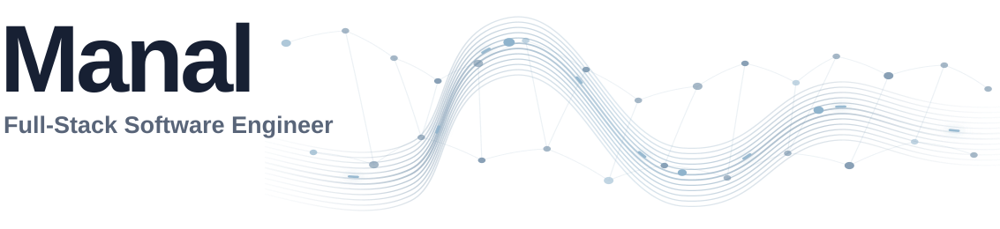
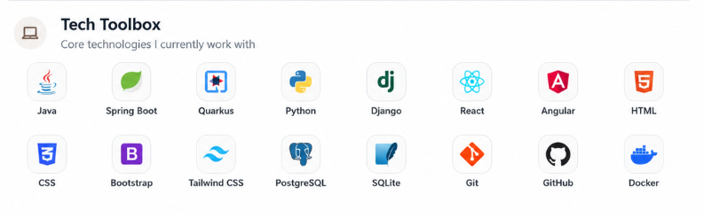

<!-- GitHub profile README for github.com/heyitsmanal -->

<picture>
  <source media="(prefers-color-scheme: dark)" srcset="./assets/header-dark.svg">
  <source media="(prefers-color-scheme: light)" srcset="./assets/header-light.svg">
  
</picture>

  
  
  
  

<picture>
  <source media="(prefers-color-scheme: dark)" srcset="./assets/header-dark.svg">
  <source media="(prefers-color-scheme: light)" srcset="./assets/header-light.svg">
  
</picture>

<picture>
  <source media="(prefers-color-scheme: dark)" srcset="./assets/about-focus-dark.svg">
  <source media="(prefers-color-scheme: light)" srcset="./assets/about-focus-light.svg">
  
</picture>

  <picture>
    <source media="(prefers-color-scheme: dark)" srcset="https://raw.githubusercontent.com/heyitsmanal/heyitsmanal/output/github-contribution-grid-snake-beige-dark.svg">
    <source media="(prefers-color-scheme: light)" srcset="https://raw.githubusercontent.com/heyitsmanal/heyitsmanal/output/github-contribution-grid-snake-beige.svg">
    
  </picture>

