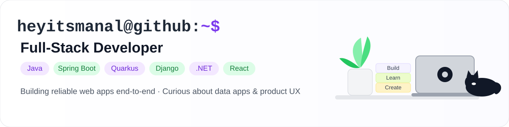
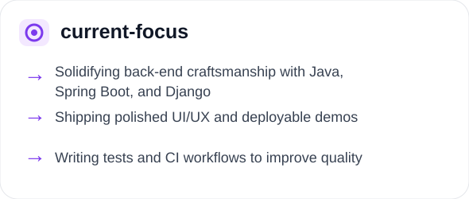
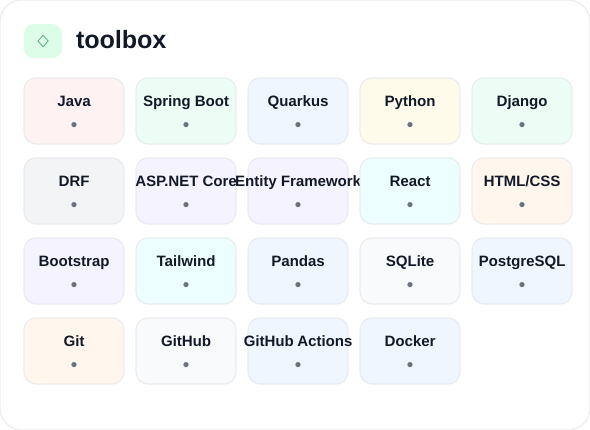
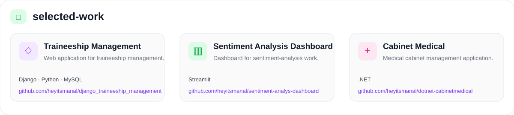

<p align="center">
  
</p>

<p align="center">
  
  
</p>

<p align="center">
  
  
</p>

## `~/` contribution-calendar

<p align="center">
  <picture>
    <source media="(prefers-color-scheme: dark)" srcset="https://raw.githubusercontent.com/heyitsmanal/heyitsmanal/output/github-contribution-grid-snake-dark.svg">
    <source media="(prefers-color-scheme: light)" srcset="https://raw.githubusercontent.com/heyitsmanal/heyitsmanal/output/github-contribution-grid-snake.svg">
    
  </picture>
</p>

## `~/` github-stats

<p align="center">
  
  
</p>

<p align="center">
  
</p>

## `~/` status

```text
Internships
Junior software engineering roles
Backend-leaning full-stack work
Code reviews
```

<p align="center">
  <code>build → learn → improve → repeat</code>
</p>
